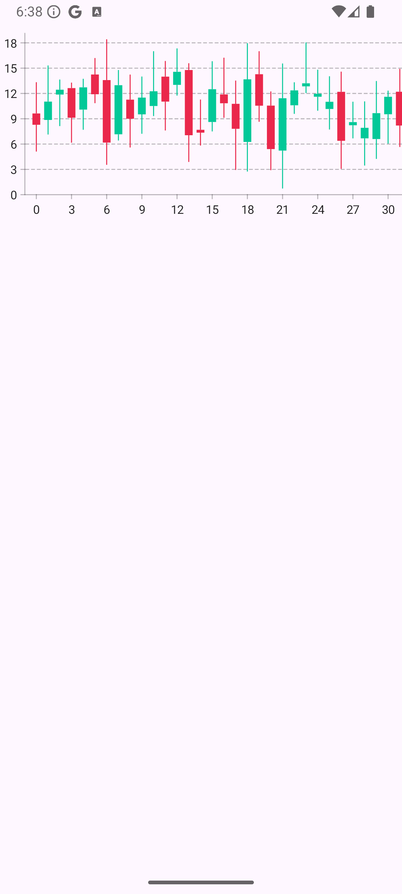
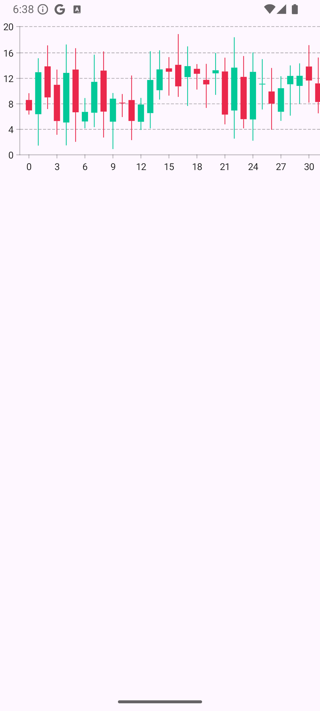
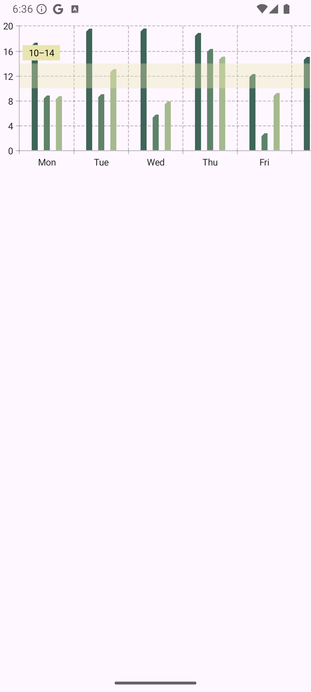
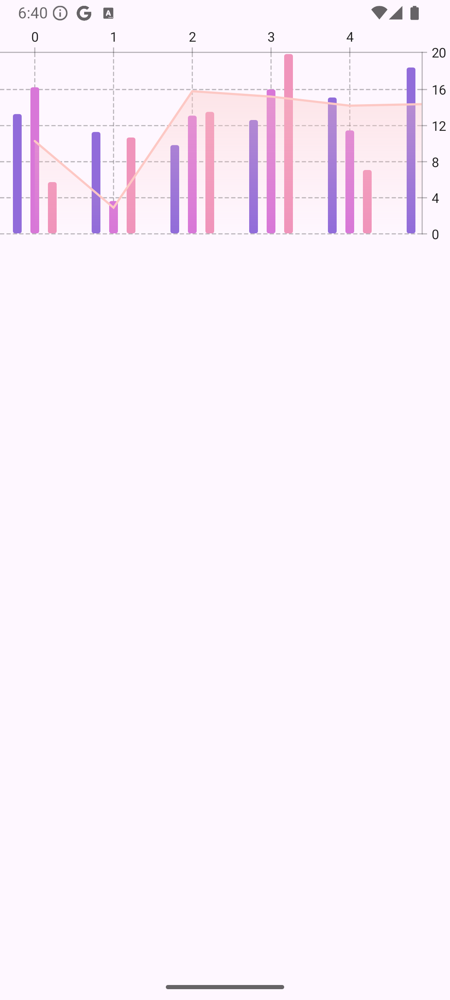
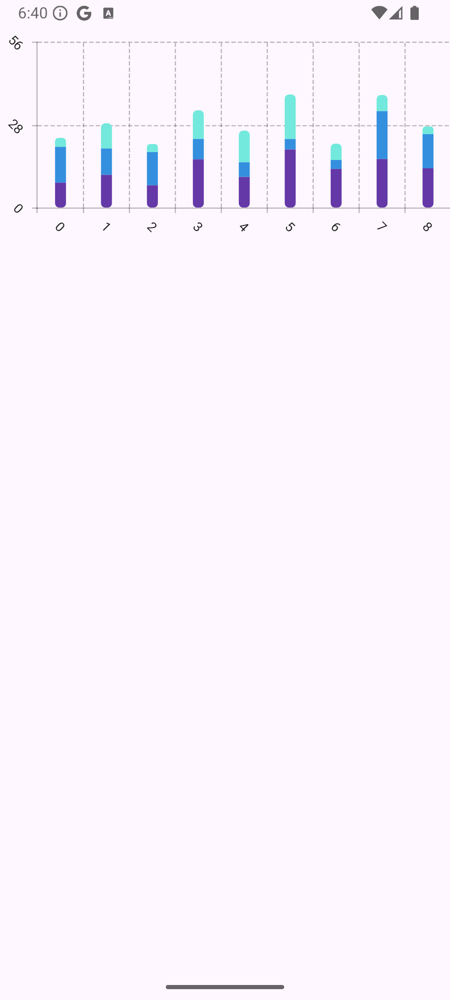

# 📊 Knjižnica Vico

**Vico** je moderna in fleksibilna knjižnica za vizualizacijo podatkov na Android platformi, zasnovana z uporabo **Jetpack Compose**. Njena glavna prednost je preprosta integracija in prilagodljivost, kar omogoča ustvarjanje interaktivnih in estetskih grafov za različne aplikacije.

---

## 🛠️ Zakaj izbrati Vico?

- **Prilagodljivost:** Omogoča podrobno prilagoditev grafov (barve, osi, oznake, animacije itd.).
- **Moderna arhitektura:** Zgrajena na principih **Jetpack Compose** za sodobne Android aplikacije.
- **Odlična podpora animacijam:** Ponuja gladke in privlačne animacije za vizualizacijo sprememb podatkov.
- **Aktivno vzdrževanje:** Knjižnica je redno posodabljana in hitro odpravlja prijavljene težave.

---

## ⚖️ Licenca - Apache 2.0

Knjižnica uporablja **Apache 2.0 licenco**, kar pomeni:
- Lahko jo **prosto uporabljate** v osebne in komercialne namene.
- Kodo lahko **spreminjate** in **distribuirate**.
- Zahteva ohranjanje obvestila o avtorstvu v izvorni kodi.
- **Značilnost:** Ne odgovarja za škodo, ki bi jo povzročila uporaba knjižnice. To pomeni, da so uporabniki odgovorni za integracijo knjižnice v svoje projekte.

Več o licenci si lahko preberete [tukaj](https://opensource.org/licenses/Apache-2.0).

---

## 📈 Statistika in aktivnost

- **Število prispevkov:** Knjižnica ima trenutno **15 prispevkov**, od katerih sta **2 bota**.
- **Zvezdice na GitHub-u:** Vico ima več kot **2000 zvezdic**, kar kaže na njeno priljubljenost in široko uporabo.
- **Aktivni issue-ji:** Trenutno je odprtih samo **5 aktivnih issue-jev**, kar pomeni, da se večina težav hitro rešuje.
- **Zadnji update:** Zadnja verzija je bila izdana **06.12.2024 ob 21:00**, kar potrjuje, da je knjižnica redno vzdrževana.
- **Pogostost posodobitev:** Večje posodobitve se izvajajo **približno enkrat na teden**, kar vključuje izboljšave in odpravo prijavljenih težav.

---

## ✅ Prednosti in slabosti

### **Prednosti**
- Preprosta integracija z **Jetpack Compose**.
- Veliko možnosti prilagoditev za različne potrebe.
- Redne posodobitve in odpravljanje težav.
- Podpora za **gladke animacije**, ki izboljšajo uporabniško izkušnjo.

### **Slabosti**
- Odvisna od **Jetpack Compose**, za nekatere funkcionalnosti ki so grafičneg tipa.
- Ne obstaja možnost prikazovanja podatkov z **PieChart**, kar je nekaterim uporabnikom zelo pomembno.
- Manjša skupnost v primerjavi z nekaterimi bolj uveljavljenimi knjižnicami, kot je **MPAndroidChart**.

---

## 📚 Primer uporabe

### **Glavni meni aplikacije in preprost primer grafa**
  
```kotlin
class Chart1Activity : AppCompatActivity() {
    private lateinit var binding: Chart1Binding
    private val modelProducer = CartesianChartModelProducer()

    override fun onCreate(savedInstanceState: Bundle?) {
        super.onCreate(savedInstanceState)
            binding = Chart1Binding.inflate(layoutInflater) // Initialize binding
            enableEdgeToEdge()
            setContentView(binding.root)
            ViewCompat.setOnApplyWindowInsetsListener(binding.root) { v, insets ->
                val systemBars = insets.getInsets(WindowInsetsCompat.Type.systemBars())
                v.setPadding(systemBars.left, systemBars.top, systemBars.right, systemBars.bottom)
                insets
            }

        binding.chartView.modelProducer = modelProducer
        lifecycleScope.launch {
            modelProducer.runTransaction { lineSeries { series(4, 12, 8, 16,25,11,1,9,8) } }
        }
    }
}
```
```XML
<FrameLayout xmlns:android="http://schemas.android.com/apk/res/android"
    xmlns:app="http://schemas.android.com/apk/res-auto"
    android:layout_width="wrap_content"
    android:layout_height="wrap_content">

    <com.patrykandpatrick.vico.views.cartesian.CartesianChartView
        android:id="@+id/chart_view"
        android:layout_width="match_parent"
        android:layout_height="wrap_content"
        app:chartStyle="@style/Chart1CartesianChartStyle"
        app:zoomEnabled="false" />
</FrameLayout>

<!--THIS NEXT PART IS IN SEPARATE DOCUMENT CALLED chart_1_styles.xml-->
<resources>
    <color name="chart_1_color_1">#a485e0</color>

    <style name="Chart1CartesianChartStyle">
        <item name="bottomAxisStyle">@style/Chart1BottomAxisStyle</item>
        <item name="layers">line</item>
        <item name="lineLayerStyle">@style/Chart1LineLayerStyle</item>
        <item name="scalableEndLayerPadding">16dp</item>
        <item name="scalableStartLayerPadding">16dp</item>
        <item name="showBottomAxis">true</item>
        <item name="showStartAxis">true</item>
    </style>

    <style name="Chart1BottomAxisStyle">
        <item name="horizontalAxisItemPlacer">segmented</item>
        <item name="showGuidelines">false</item>
    </style>

    <style name="Chart1Line1Style">
        <item name="android:color">@color/chart_1_color_1</item>
    </style>

    <style name="Chart1LineLayerStyle">
        <item name="line1Style">@style/Chart1Line1Style</item>
    </style>
</resources>
```

### **Primer dinamicneg grafa (Live Data)**
Tuki se lahko vidi da je ura zgoraj ista in da so prikazani drugi podatki ki so prišli, v tem primeru se lepo vidi raznolika uporabnost knjižnice in lepa implementacija animacij.

  
```kotlin
@SuppressLint("RestrictedApi")
class ChartViewModel : ViewModel() {
    val modelProducer = CartesianChartModelProducer()

    init {
        viewModelScope.launch(Dispatchers.Default) {
            while (isActive) {
                modelProducer.runTransaction {
                    add(RandomCartesianModelGenerator.getRandomCandlestickLayerModelPartial())
                }
                delay(5000L)
            }
        }
    }
}

class Chart3Activity : AppCompatActivity() {
    private lateinit var binding: Chart3Binding

    private val chartViewModel: ChartViewModel by viewModels()

    @SuppressLint("SetTextI18n")
    override fun onCreate(savedInstanceState: Bundle?) {
        super.onCreate(savedInstanceState)


        binding = Chart3Binding.inflate(layoutInflater)
        enableEdgeToEdge()
        setContentView(binding.root)

        ViewCompat.setOnApplyWindowInsetsListener(binding.root) { v, insets ->
            val systemBars = insets.getInsets(WindowInsetsCompat.Type.systemBars())
            v.setPadding(systemBars.left, systemBars.top, systemBars.right, systemBars.bottom)
            insets
        }

        binding.chartView.modelProducer = chartViewModel.modelProducer

    }
}
```
```XML
<FrameLayout xmlns:android="http://schemas.android.com/apk/res/android"
    xmlns:app="http://schemas.android.com/apk/res-auto"
    android:layout_width="wrap_content"
    android:layout_height="wrap_content">

    <com.patrykandpatrick.vico.views.cartesian.CartesianChartView
        android:id="@+id/chart_view"
        android:layout_width="match_parent"
        android:layout_height="wrap_content"
        app:chartStyle="@style/Chart3CartesianChartStyle" />
</FrameLayout>

<!--THIS NEXT PART IS IN SEPARATE DOCUMENT CALLED chart_3_styles.xml-->
<resources>
    <style name="Chart3BottomAxisStyle">
        <item name="addExtremeHorizontalAxisLabelPadding">true</item>
        <item name="horizontalAxisLabelSpacing">3</item>
        <item name="showGuidelines">false</item>
    </style>

    <style name="Chart3CartesianChartStyle">
        <item name="bottomAxisStyle">@style/Chart3BottomAxisStyle</item>
        <item name="layers">candlestick</item>
        <item name="showBottomAxis">true</item>
        <item name="showStartAxis">true</item>
    </style>
</resources>
```

### **Še nekaj primerov uporabe in možnosti prikazovanja različnih podatkov**
Vsi spodnji primeri imajo možnost pikazovanja več različnih podatkov ki se ujemajo po določeni kriteriji, npr. isti dan v tednu ali nekaj podrobnega.



```kotlin
private const val HORIZONTAL_BOX_COLOR = -1448529
private const val HORIZONTAL_BOX_ALPHA = 0.36f
private const val HORIZONTAL_BOX_LABEL_HORIZONTAL_PADDING_DP = 8f
private const val HORIZONTAL_BOX_LABEL_VERTICAL_PADDING_DP = 2f
private const val HORIZONTAL_BOX_LABEL_MARGIN_DP = 4f

private val horizontalBoxY = 10.0..14.0
private val daysOfWeek = listOf("Mon", "Tue", "Wed", "Thu", "Fri", "Sat", "Sun")
private val bottomAxisValueFormatter = CartesianValueFormatter { _, x, _ ->
    daysOfWeek[x.toInt() % daysOfWeek.size]
}

class Chart2Activity : AppCompatActivity() {
    private lateinit var binding: Chart2Binding
    private val modelProducer = CartesianChartModelProducer()


    override fun onCreate(savedInstanceState: Bundle?) {
        super.onCreate(savedInstanceState)
        binding = Chart2Binding.inflate(layoutInflater).apply {
            with(chartView) {
                chart =
                    chart?.copy(
                        bottomAxis =
                        (chart?.bottomAxis as HorizontalAxis).copy(valueFormatter = bottomAxisValueFormatter),
                        decorations = listOf(getViewHorizontalBox()),
                    )
                this.modelProducer = modelProducer
            }
        }
        enableEdgeToEdge()
        setContentView(binding.root)
        ViewCompat.setOnApplyWindowInsetsListener(binding.root) { v, insets ->
            val systemBars = insets.getInsets(WindowInsetsCompat.Type.systemBars())
            v.setPadding(systemBars.left, systemBars.top, systemBars.right, systemBars.bottom)
            insets
        }

        binding.chartView.modelProducer = modelProducer
        lifecycleScope.launch {
            modelProducer.runTransaction { columnSeries {
                repeat(3) {
                    series(
                        List(50) {
                            2 + Random.nextFloat() * 18
                        }
                    )
                }
            } }
        }
    }


    private fun getViewHorizontalBox(): HorizontalBox {
        val color = Color(HORIZONTAL_BOX_COLOR)
        return HorizontalBox(
            y = { horizontalBoxY },
            box = ShapeComponent(Fill(color.copy(HORIZONTAL_BOX_ALPHA).toArgb())),
            labelComponent =
            TextComponent(
                margins = Dimensions(HORIZONTAL_BOX_LABEL_MARGIN_DP),
                padding =
                Dimensions(
                    HORIZONTAL_BOX_LABEL_HORIZONTAL_PADDING_DP,
                    HORIZONTAL_BOX_LABEL_VERTICAL_PADDING_DP,
                ),
                background = ShapeComponent(Fill(color.toArgb()), Shape.Rectangle),
            ),
        )
    }
}
```
```XML
<resources>
    <color name="chart_2_color_1">#3e6558</color>
    <color name="chart_2_color_2">#5e836a</color>
    <color name="chart_2_color_3">#a5ba8e</color>

    <style name="Chart2CartesianChartStyle">
        <item name="bottomAxisStyle">@style/Chart2BottomAxisStyle</item>
        <item name="columnLayerStyle">@style/Chart2ColumnLayerStyle</item>
        <item name="layers">column</item>
        <item name="previewColumnSeriesCount">3</item>
        <item name="scalableEndLayerPadding">16dp</item>
        <item name="scalableStartLayerPadding">16dp</item>
        <item name="showBottomAxis">true</item>
        <item name="showStartAxis">true</item>
    </style>

    <style name="Chart2BottomAxisStyle">
        <item name="horizontalAxisItemPlacer">segmented</item>
    </style>

    <style name="Chart2ColumnShapeStyle">
        <item name="topStartCornerSize">50%</item>
        <item name="topStartCornerTreatment">cut</item>
    </style>

    <style name="Chart2ColumnStyle">
        <item name="shapeStyle">@style/Chart2ColumnShapeStyle</item>
    </style>

    <style name="Chart2Column1Style" parent="@style/Chart2ColumnStyle">
        <item name="android:color">@color/chart_2_color_1</item>
    </style>

    <style name="Chart2Column2Style" parent="@style/Chart2ColumnStyle">
        <item name="android:color">@color/chart_2_color_2</item>
    </style>

    <style name="Chart2Column3Style" parent="@style/Chart2ColumnStyle">
        <item name="android:color">@color/chart_2_color_3</item>
    </style>

    <style name="Chart2ColumnLayerStyle">
        <item name="column1Style">@style/Chart2Column1Style</item>
        <item name="column2Style">@style/Chart2Column2Style</item>
        <item name="column3Style">@style/Chart2Column3Style</item>
    </style>
</resources>
```
 

```kotlin
class Chart4Activity : AppCompatActivity() {
    private lateinit var binding: Chart4Binding
    private val modelProducer = CartesianChartModelProducer()

    override fun onCreate(savedInstanceState: Bundle?) {
        super.onCreate(savedInstanceState)
        binding = Chart4Binding.inflate(layoutInflater) // Initialize binding
        enableEdgeToEdge()
        setContentView(binding.root)
        ViewCompat.setOnApplyWindowInsetsListener(binding.root) { v, insets ->
            val systemBars = insets.getInsets(WindowInsetsCompat.Type.systemBars())
            v.setPadding(systemBars.left, systemBars.top, systemBars.right, systemBars.bottom)
            insets
        }

        binding.chartView.modelProducer = modelProducer
        lifecycleScope.launch {
            modelProducer.runTransaction { columnSeries {
                repeat(3) {
                    series(
                        List(50) {
                            2 +
                                    Random.nextFloat() * 18
                        }
                    )
                }
            }
                /* Learn more:
                https://patrykandpatrick.com/vico/wiki/cartesian-charts/layers/line-layer#data. */
                lineSeries { series(List(50) { Random.nextFloat() * 20 }) } }
        }
    }
}
```
```XML
<resources>
    <color name="chart_4_color_1">#916cda</color>
    <color name="chart_4_color_2">#d877d8</color>
    <color name="chart_4_color_3">#f094bb</color>
    <color name="chart_4_color_4">#fdc8c4</color>

    <style name="Chart4CartesianChartStyle">
        <item name="bottomAxisStyle">@style/Chart4BottomAxisStyle</item>
        <item name="columnLayerStyle">@style/Chart4ColumnLayerStyle</item>
        <item name="layers">line|column</item>
        <item name="lineLayerStyle">@style/Chart4LineLayerStyle</item>
        <item name="scalableEndLayerPadding">16dp</item>
        <item name="scalableStartLayerPadding">16dp</item>
        <item name="showEndAxis">true</item>
        <item name="showTopAxis">true</item>
    </style>

    <style name="Chart4BottomAxisStyle">
        <item name="horizontalAxisItemPlacer">segmented</item>
    </style>

    <style name="Chart4ColumnShapeStyle">
        <item name="cornerSize">2dp</item>
    </style>

    <style name="Chart4ColumnStyle">
        <item name="shapeStyle">@style/Chart4ColumnShapeStyle</item>
    </style>

    <style name="Chart4Column1Style" parent="@style/Chart4ColumnStyle">
        <item name="android:color">@color/chart_4_color_1</item>
    </style>

    <style name="Chart4Column2Style" parent="@style/Chart4ColumnStyle">
        <item name="android:color">@color/chart_4_color_2</item>
    </style>

    <style name="Chart4Column3Style" parent="@style/Chart4ColumnStyle">
        <item name="android:color">@color/chart_4_color_3</item>
    </style>

    <style name="Chart4Line1Style">
        <item name="android:color">@color/chart_4_color_4</item>
        <item name="curvature">0%</item>
    </style>

    <style name="Chart4ColumnLayerStyle">
        <item name="column1Style">@style/Chart4Column1Style</item>
        <item name="column2Style">@style/Chart4Column2Style</item>
        <item name="column3Style">@style/Chart4Column3Style</item>
    </style>

    <style name="Chart4LineLayerStyle">
        <item name="line1Style">@style/Chart4Line1Style</item>
    </style>
</resources>
```
 

```koltin
private val startAxisItemPlacer = VerticalAxis.ItemPlacer.count({ 3 })

class Chart5Activity : AppCompatActivity() {
    private lateinit var binding: Chart5Binding
    private val modelProducer = CartesianChartModelProducer()

    override fun onCreate(savedInstanceState: Bundle?) {
        super.onCreate(savedInstanceState)
        binding = Chart5Binding.inflate(layoutInflater).apply {
            with(chartView){
                chart = chart?.copy(
                    startAxis = (chart?.startAxis as VerticalAxis).copy(itemPlacer = startAxisItemPlacer),
                )
                this.modelProducer = modelProducer
            }
        }

        enableEdgeToEdge()
        setContentView(binding.root)
        ViewCompat.setOnApplyWindowInsetsListener(binding.root) { v, insets ->
            val systemBars = insets.getInsets(WindowInsetsCompat.Type.systemBars())
            v.setPadding(systemBars.left, systemBars.top, systemBars.right, systemBars.bottom)
            insets
        }

        binding.chartView.modelProducer = modelProducer
        lifecycleScope.launch {
            modelProducer.runTransaction { columnSeries {
                repeat(3) {
                    series(
                        List(50) {
                            2 + Random.nextFloat() * 18
                        }
                    )
                }
            } }
        }
    }
}
```
```XML
<resources>
    <color name="chart_5_color_1">#6438a7</color>
    <color name="chart_5_color_2">#3490de</color>
    <color name="chart_5_color_3">#73e8dc</color>

    <style name="Chart5CartesianChartStyle">
        <item name="bottomAxisStyle">@style/Chart5BottomAxisStyle</item>
        <item name="columnLayerStyle">@style/Chart5ColumnLayerStyle</item>
        <item name="layers">column</item>
        <item name="scalableEndLayerPadding">16dp</item>
        <item name="scalableStartLayerPadding">16dp</item>
        <item name="showBottomAxis">true</item>
        <item name="showStartAxis">true</item>
        <item name="startAxisStyle">@style/Chart5AxisStyle</item>
    </style>

    <style name="Chart5Column1ShapeStyle">
        <item name="topStartCornerSize">0dp</item>
        <item name="topEndCornerSize">0dp</item>
        <item name="bottomEndCornerSize">40%</item>
        <item name="bottomStartCornerSize">40%</item>
    </style>

    <style name="Chart5Column2ShapeStyle">
        <item name="cornerSize">0dp</item>
    </style>

    <style name="Chart5Column3ShapeStyle">
        <item name="topStartCornerSize">40%</item>
        <item name="topEndCornerSize">40%</item>
        <item name="bottomEndCornerSize">0dp</item>
        <item name="bottomStartCornerSize">0dp</item>
    </style>

    <style name="Chart5Column1Style">
        <item name="android:color">@color/chart_5_color_1</item>
        <item name="shapeStyle">@style/Chart5Column1ShapeStyle</item>
        <item name="thickness">10dp</item>
    </style>

    <style name="Chart5Column2Style">
        <item name="android:color">@color/chart_5_color_2</item>
        <item name="shapeStyle">@style/Chart5Column2ShapeStyle</item>
        <item name="thickness">10dp</item>
    </style>

    <style name="Chart5Column3Style">
        <item name="android:color">@color/chart_5_color_3</item>
        <item name="shapeStyle">@style/Chart5Column3ShapeStyle</item>
        <item name="thickness">10dp</item>
    </style>

    <style name="Chart5AxisStyle">
        <item name="labelRotationDegrees">45</item>
    </style>

    <style name="Chart5BottomAxisStyle" parent="Chart5AxisStyle">
        <item name="horizontalAxisItemPlacer">segmented</item>
    </style>

    <style name="Chart5ColumnLayerStyle">
        <item name="column1Style">@style/Chart5Column1Style</item>
        <item name="column2Style">@style/Chart5Column2Style</item>
        <item name="column3Style">@style/Chart5Column3Style</item>
        <item name="mergeMode">stacked</item>
    </style>
</resources>
```


