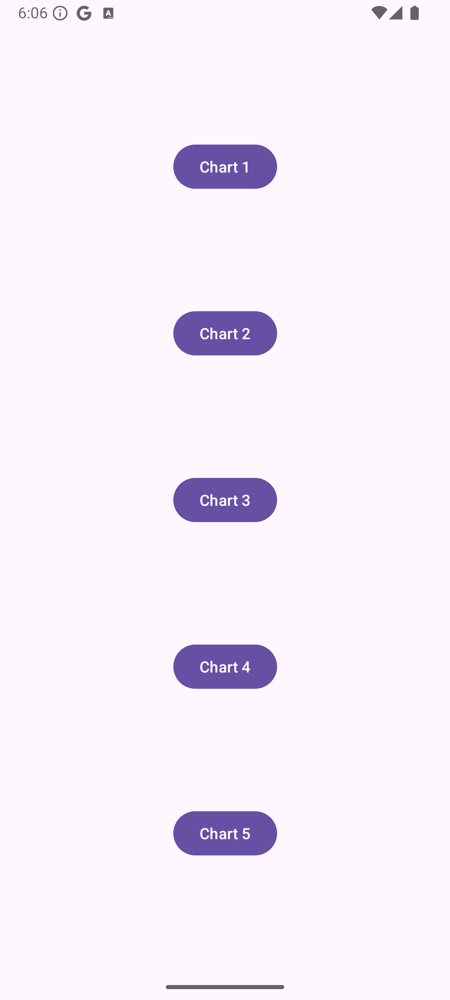
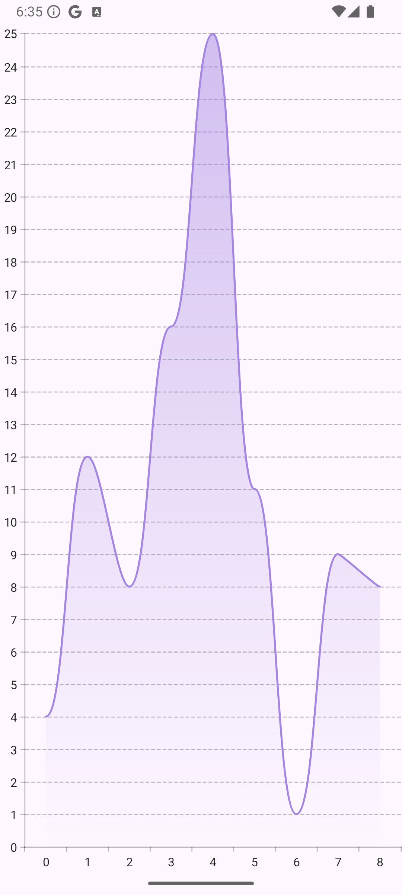

# 📊 Knjižnica Vico

**Vico** je moderna in fleksibilna knjižnica za vizualizacijo podatkov na Android platformi, zasnovana z uporabo **Jetpack Compose**. Njena glavna prednost je preprosta integracija in prilagodljivost, kar omogoča ustvarjanje interaktivnih in estetskih grafov za različne aplikacije.

---

## 🛠️ Zakaj izbrati Vico?

- **Prilagodljivost:** Omogoča podrobno prilagoditev grafov (barve, osi, oznake, animacije itd.).
- **Moderna arhitektura:** Zgrajena na principih **Jetpack Compose** za sodobne Android aplikacije.
- **Odlična podpora animacijam:** Ponuja gladke in privlačne animacije za vizualizacijo sprememb podatkov.
- **Aktivno vzdrževanje:** Knjižnica je redno posodabljana in hitro odpravlja prijavljene težave.

---

## ⚖️ Licenca - Apache 2.0

Knjižnica uporablja **Apache 2.0 licenco**, kar pomeni:
- Lahko jo **prosto uporabljate** v osebne in komercialne namene.
- Kodo lahko **spreminjate** in **distribuirate**.
- Zahteva ohranjanje obvestila o avtorstvu v izvorni kodi.
- **Značilnost:** Ne odgovarja za škodo, ki bi jo povzročila uporaba knjižnice. To pomeni, da so uporabniki odgovorni za integracijo knjižnice v svoje projekte.

Več o licenci si lahko preberete [tukaj](https://opensource.org/licenses/Apache-2.0).

---

## 📈 Statistika in aktivnost

- **Število prispevkov:** Knjižnica ima trenutno **15 prispevkov**, od katerih sta **2 bota**.
- **Zvezdice na GitHub-u:** Vico ima več kot **2000 zvezdic**, kar kaže na njeno priljubljenost in široko uporabo.
- **Aktivni issue-ji:** Trenutno je odprtih samo **5 aktivnih issue-jev**, kar pomeni, da se večina težav hitro rešuje.
- **Zadnji update:** Zadnja verzija je bila izdana **06.12.2024 ob 21:00**, kar potrjuje, da je knjižnica redno vzdrževana.
- **Pogostost posodobitev:** Večje posodobitve se izvajajo **približno enkrat na teden**, kar vključuje izboljšave in odpravo prijavljenih težav.

---

## ✅ Prednosti in slabosti

### **Prednosti**
- Preprosta integracija z **Jetpack Compose**.
- Veliko možnosti prilagoditev za različne potrebe.
- Redne posodobitve in odpravljanje težav.
- Podpora za **gladke animacije**, ki izboljšajo uporabniško izkušnjo.

### **Slabosti**
- Odvisna od **Jetpack Compose**, kar pomeni, da ni združljiva s klasičnim View sistemom.
- Manjša skupnost v primerjavi z nekaterimi bolj uveljavljenimi knjižnicami, kot je **MPAndroidChart**.

## 📚 Primer uporabe

### **Glavni meni aplikacije in preprost primer grafa**

